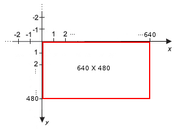
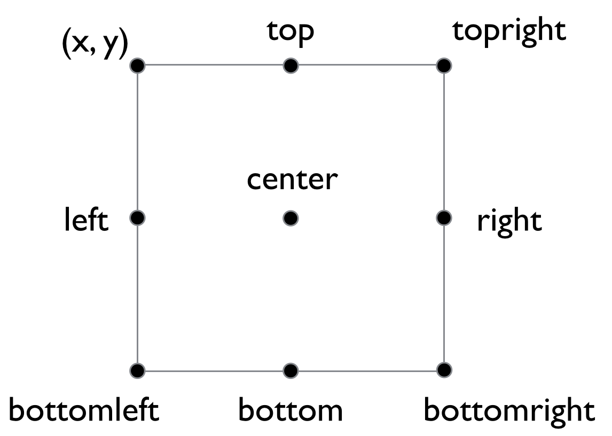

# 게임 개발 부서
<hr>

<h2>1차시: pygame의 기본 구성</h2>
<ol>
    <li>window 객체</li>
    <li>game loop</li>
    <li>exit 이벤터 처리</li>
    <li>Clock 객체</li>
    <li>surface, rect 객체</li>
    <li>rect 객체 이동 및 이동 범위 제한</li>
</ol>

<h3>1. window 객체</h3>
<p>window 객체는 게임 화면 객체이다. 다음과 같이 window 객체를 생성한다.</p>

```python
import pygame

winodw = pygame.display.set_mode((1200, 900))  # (가로 길이, 세로 길이)
```
<p>
set_mode()함수는 (가로, 세로)의 스퀸스(순서가 있는 자료형(ex. list, tuple)) 자료형 하나를 받는다.
대게 가로 길이와 세로 길이를 WINDOW_WIDTH, WINDOW_HEIGHT라는 변수로 저장해둔 후, 이를 이용해  window 객체를 생성한다.
</p>

```python
import pygame

WINDOW_WIDTH = 1200
WINDOW_HEIGHT = 900
window = pygame.display.set_mode((WINDOW_WIDTH, WINDOW_HEIGHT))
```
<p>window는 surface 객체이기 때문에, surface 클래스의 모든 메서드를 사용할 수 있다. surface 클래스는 4번에서 알아보자.</p>

<h3>2. game loop</h3>
<p>
게임이 진행되는 동안 반복적으로 실행되는 코드 덩어리가 필요한데, 이를 게임 루프라고 한다.
지오메트리로 예를 들면, Start를 누르고, 게임이 끝날 때까지, 캐릭터를 움직이고, 화면을 이동시키는 반복 작업이 필요하다.
그리고 이것을 game loop라고 부른다. (정식용어는 아니기 때문에, 면접에서 쓰지는 말자)
Pygame에서는 다음과 같이 프로그래밍 한다.
</p>

```python
import pygame

running = True  # 게임이 종료될 때까지 True로 유지된다. 게임이 종료될 때 False로 값을 바꾸어 주면 된다.
while running:  # 게임이 종료될 때까지 아래 코드를 계속 반복한다.
    ...
    
    pygame.display.update()  # 현재 상태를 업데이트 한다. 그냥 무조건 붙이면 된다.
```

<h3>3. exit 이벤트 처리</h3>
<p>화면에는 X 버튼이 존재하지만, 눌러도 게임이 종료되지 않는다. 다음과 같이 이벤트 처리를 해준다.</p>

```python
import pygame

for event in pygame.event.get():
    if event.type == pygame.EXIT:
        running = False
```
<ul> 코드 설명:
    <li>pygame.event.get(): 지금까지 발생한 모든 이벤트를 리스트로 묶어 반환하는 함수이다.</li>
    <li>event.type: 해당 이벤트가 어떤 이벤트인지 정보가 들어있다. (ex. EXIT, KEYPRESS 등)</li>
</ul>

<h3>4. Clock 객체</h3>
<p>
clock 객체는 pygame에서 시간과 관련된 것들을 컨트롤 하는 질리언 같은 존재이다. <br> 다음과 같이 게임 속도를 조정할 수 있다. </p>

```python
import pygame

clock = pygame.time.Clock()  # clock 객체 선언 (game loop 밖에서 해야함)

running = True
while running:
    ...

    clock.tick(60)  # 프레임 설정 (게임 루프 안에 넣어야 함)
```
<p>game loop 안에 다음과 같은 코드를 넣으면, 1초에 game loop를 60번 실행한다.</p>

<h3>5. Surface, Rect 클래스</h3>
<h4>5 - 1. Surface 객체</h4>
<p>Surface 객체는 화면에 나타나는 그림이다. 단순 그림이기 때문에, 그 외의 어떠한 기능도 없다. 다음과 같이 객체를 생성한다. </p>

```python
import pygame

# 정사각형 모양의 Surface 객체를 생성할 때 코드
surface = pygame.Surface((50, 50))  # (가로 길이, 세로 길이)

# 이미지로부터 Surface 객체를 생성할 때 코드
surface = pygame.image.load('이미지 경로')
```
<p>Surface 객체는 다양한 메서드 들을 가지고 있다. 많이 쓰이는 몇개만 살펴보면 다음과 같다.</p>
<ul>
    <li>.fill((RGB 값)) : 해당 색깔로 Surface 객체를 칠한다.</li>
    <li>.blit(surface 객체, rect 객체) : 해당 객체를 Surface 객체에 칠한다.</li>
    <li>.get_rect(): Surface 객체에 대응되는 Rect 객체를 생성한다.</li>
</ul>
<p>Surface 객체 내의 좌표는 다음 그림과 같다.</p>

<h4>5 - 2. Rect 객체</h4>
<p>
Rect 객체는 게임의 '히트박스'이다.
Surface 객체와 정 반대로, 화면에 나타나지는 않지만 프로그램은 Rect 객체로를 기반으로 해당 엔티티를 인식한다.
Rect 객체는 다음과 같이 생성한다.
</p>

```python
import pygame

surface = pygame.Surface((50, 50))  # Rect 객체 생성을 위한 Surface 객체 생성

rect = surface.get_rect()  # Rect 객체 생성
```
<p>
위의 코드는 Surface 객체에 대응되는 Rect 객체를 생성해 준다. Surface 객체와 Rect 객체는 항상 함께 다닌다.
blit() 메서드에서 이 둘을 매개변수로 받는 것도 둘이 커플이기 때문이다.
</p>
<p>Rect 객체를 움직이는 코드는 다음과 같다.</p>
<p style="font-weight: bold"> rect.move_ip(x축 방향 이동거리, y축 방향 이동거리)</p>
<p>Rect 객체는 엔티티의 좌표에 대한 정보를 가지고 있다. 해당 정보는 다음과 같다.</p>
<ul>
    <li>rect.top : 객체의 위쪽 모서리의 y 좌표</li>
    <li>rect.bottom : 객체의 아래쪽 모서리의 y 좌표</li>
    <li>rect.left , rect.right : 각각 객체의 왼쪽, 오른쪽 x 좌표</li>
    <li>rect.center : 객체의 중심 좌표</li>
    <li>rect.centerx, rect.centery : 각각 객체 중심의 x좌표, y좌표</li>
    <li>
    그림으로 살펴보면 다음과 같다.
    
    </li>
</ul>

<h3>6. Rect 객체의 이동 제한</h3>
WASD 키를 이용해서 Rect 객체의 위치를 바꾸는 법은 다음과 같다.

```python
import pygame

# window 객체 설정
WINDOW_WIDTH = 1200
WINDOW_HEIGHT = 900
window = pygame.display.set_mode((WINDOW_WIDTH, WINDOW_HEIGHT))

# rect 객체 생성을 위한 surface 객체 생성
surface = pygame.Surface((50, 50))

# rect 객체 생성
rect = surface.get_rect()

# x축 방향 이동 제한
keys = pygame.key.get_pressed()  # 현재 눌려있는 키들을 리스트로 반환
if keys[pygame.K_a]:  # a 키가 눌려 있을 떄
    rect.move_ip(-10, 0)  # x축 방향으로 -10 만큼 이동
if keys[pygame.K_d]:  # d 키가 눌려 있으 때
    rect.move_ip(10, 0)  # x축 방향으로 10만큼 이동
```
위의 Rect 객체 위치를 움직이는 코드는 반복해서 실행되어야 한다. 따라서 game loop 안에 존재해야 한다.
<p>엔티티가 화면 밖을 나가는 불상사는 발생하면 안된다. 따라서 엔티티의 이동을 제한할 필요가 있다.</p>

```python
import pygame

# window 객체 설정
WINDOW_WIDTH = 1200
WINDOW_HEIGHT = 900
window = pygame.display.set_mode((WINDOW_WIDTH, WINDOW_HEIGHT))

# rect 객체 생성을 위한 surface 객체 생성
surface = pygame.Surface((50, 50))

# rect 객체 생성
rect = surface.get_rect()

# x축 방향 이동 제한
if rect.right > WINDOW_WIDTH:  # 오른쪽 x좌표가 화면 가로 길이보다 길면
    rect.right = WINDOW_WIDTH  # 오른쪽 x좌표를 화면 가로 길이로 맞춤
    
if rect.left < 0:  # 왼쪽 x 좌표가 음수이면
    rect.left = 0  # 왼쪽 x 좌표를 0으로 맞춤
```
다음과 같이 엔티티가 가로 방향으로 밖으로 나가는 것을 방지할 수 있다.

**`1차시 과제: WADS키로 상하좌우로 움직이는 게임을 만들어보자`**
<hr>

<h2>2차시: sprite 객체</h2>
<ol>
    <li>sprite 객체</li>
    <li>group 객체</li>
    <li>sprite 객체 충돌 처리</li>
    <li>시간 단위 이벤트 처리</li>
</ol>

### 1. sprite 객체
Surface 객체와 Rect 객체는 한 몸이다. 그럼에도 우리는 Surface 객체와 Rect 객체를 따로 정의해줘야 한다.
이것은 불편하다. 이 둘을 변수 1개로 묶어서 데리고 다닐 수 있으면 좋을 것 같다.
그러한 의미에서 만들어진 것이 Sprite 객체이다.

Sprite는 보통 Sprite Class를 상속받아 새로운 Class를 만들어 사용한다.
Sprite 클래스를 상속받는 방법은 다음과 같다.
```python
import pygame

class CustomClass(pygame.sprite.Sprite): # 상속을 받는 코드 1
    def __init__(self):
        super().__init__()  # 상속을 받는 코드 2
```
보이는 것처럼  "(pygame.sprite.Sprite)"와 "super().__init__()"를 무조건 넣어야 한다.
넣지 않으면 상속이 되지 않는다. Customclass는 클래스의 이름으로, 마음대로 지정할 수 있다.

Sprite 클래스를 상속받았다면 이제 Surface 객체와 Rect 객체를 Sprite 객체에 넣어줘야 할 것이다.
넣는 방법은 다음과 같다.
```python
import pygame

class Player(pygame.sprite.Sprite):
    def __init__(self):
        super().__init__()
        self.image = pygame.Surface((100, 100))
        # pygame.image.load()를 사용해도 당연히 된다.
        
        self.rect = self.image.get_rect()
```
클래스에서 변수를 저장할 때는 앞에 self를 붙여주어야 나중에 사용할 수 있다. 아니면 사용하지 못한다.
추가로 surface 객체는 image라는 변수명으로 **무조건** 저장해야 한다. 다른건 안된다.

클래스는 설계도이다. 그럼 위의 Player 클래스를 이용해 플레이어 Sprite를 만들어 보자.
```python
import pygame

class Player(pygame.sprite.Sprite):
    def __init__(self):
        super().__init__()
        self.image = pygame.Surface((100, 100))
        self.rect = self.image.get_rect()

        self.image.fill((255, 0, 0)) # surface 객체를 빨강으로 칠함

player = Player()  # sprite 객체 player 선언

player.image.fill((0, 255, 0))  # surface 객체를 초록으로 칠함
player.rect.x += 1  # x좌표 1만큼 이동
```
Sprite 객체의 surface 객체와 rect 객체에 접근하는 방법은 위와 같다.

Sprite 객체에는 update()라는 메서드가 존재한다.
이 메서드에는 Sprite 객체의 움직임과 관련된 코드들이 들어가면 된다.
밑의 코드는 player의 AD키 이동 관련 코드를 넣은 것이다.
```python
import pygame

class Player(pygame.sprite.Sprite):
    def __init__(self):
        super().__init__()
        self.image = pygame.Surface((100, 100))
        self.rect = self.image.get_rect()

        self.image.fill((255, 0, 0)) # surface 객체를 빨강으로 칠함

    def update(self):
        keys = pygame.key.get_pressed()
        if keys[pygame.K_a]:
            self.rect.x -= 10
        if keys[pygame.k_d]:
            self.rect.x += 10
```
update() 메서드에 움직임과 관련된 코드를 넣으면,
뒤에 나오는 group을 이용해 여러 Sprite 들의 update()를 한번에 실행시킬 수 있다.
즉, 코드 한줄로 모든 엔티티가 움직이게 할 수 있다!

### 2. Group 객체
Group객체는 Sprite 객체들을 한데에 묶어 한번에 처리할 수 있도록 만들어진 객체이다.

Sprite 객체는 클래스를 상속받아서 새로운 클래스를 만들어야 해 사용하기 매우 어려웠다.
그에 비해 Group 객체를 사용하는 법은 매우 간단하다. 다음과 같이 Group 객체를 선언한다.
```python
import pygame

# group 객체 생성
group = pygame.sprite.Group()
```
당연하겠지만 Group 객체의 이름은 맘대로 정할 수 있다.

Group 객체에 Sprite 객체를 추가/제거하는 법은 다음과 같다.
```python
import pygame

class Player(pygame.sprite.Sprite):
    def __init__(self):
        super().__init__()
        self.image = pygame.Surface((100, 100))
        self.rect = self.image.get_rect()

player_1 = Player()  # player_1: Sprite 객체 생성
player_group = pygame.sprite.Group()  # Group 객체 생성

# player_1을 player_group에 추가
player_group.add(player_1)
# player_1을 player_group에서 제거
player_group.remove(player_1)
```
Group 객체 안에 있는 모든 Sprite 들을 한번에 update 하거나, 화면에 blit 할 수 있다.
코드는 다음과 같다.
```python
import pygame

window_w = 1200
window_h = 900
# window 객체 생성
window = pygame.display.set_mode((window_w, window_h))

player_group = pygame.sprite.Group()

# player_group에 있는 모든 Sprite 업데이트
player_group.update()
# player_group에 있는 모든 Sprite를 window에 칠함
player_group.draw(window)
```

### 3. Sprite 객체 충돌 처리
#### 3-1 Sprite - Sprite 충돌
두 Sprite 간의 충돌을 처리하는 rect 객체에 있는 colliderect 메서드를 이용한다.
```python
import pygame

class Player(pygame.sprite.Sprite):
    def __init__(self):
        super().__init__()
        self.image = pygame.Surface((50, 50))
        self.rect = self.image.get_rect()

player_1 = Player()
player_2 = Player()

# 충돌 처리 코드, 둘은 같은 결과이다.
print(player_1.rect.colliderect(player_2.rect))
print(player_2.rect.colliderect(player_1.rect))
```
colliderect() 메서드는 매개변수로 다른 Rect 객체를 받고, 충돌 했으면 True 아니면 False를 출력한다.

#### 3-2 Sprite Group간 충돌
밀려오는 적 100명이 있어서 그들에 대해 전부 충돌 처리를 해야한다고 해보자.
이때는 적 100명을 한 그룹에 넣은 후, 처리한다.
```python
import pygame

class Player(pygame.sprite.Sprite):
    def __init__(self):
        super().__init__()
        self.image = pygame.Surface((50, 50))
        self.rect = self.image.get_rect()

player = Player()
enemy_group = pygame.sprite.Group()

# 충돌 처리 코드
print(pygame.sprite.spritecollide(player, enemy_group, True))
```
pygame.sprite 모듈에는 spritecollide라는 함수가 있다.
이 함수는 매개변수로 sprite 객체, group 객체를 받고 bool 형의 dokill 매개변수도 받는다.
dokill이 True이면 group내에서 충돌한 객체들을 제거해준다.
해당 함수는 충돌한 group 내의 객체들을 모아 list로 출력한다.
따라서 print()를 하면 충돌한 enemy들이 list로 출력될 것이다.

### 4. 시간 단위 이벤트 처리
x초 마다 실행시키고 싶은 코드가 있다고 하자. 다음과 같이 구현한다.
```python
import pygame

clock = pygame.time.Clock()
# custom event 만들기
event_1 = pygame.USEREVENT + 1  # +1은 첫번째 사용자 설정 이벤트를 의미

# event_1 이벤트를 1000ms(= 1초)마다 활성화
pygame.time.set_timer(event_1, 1000)
```
해당 이벤트가 활성화 되어 있는지 확인하는 방법은 다음과 같다.
```python
import pygame

clock = pygame.time.Clock()
# custom event 만들기
event_1 = pygame.USEREVENT + 1  # +1은 첫번째 사용자 설정 이벤트를 의미

# event_1 이벤트를 1000ms(= 1초)마다 활성화
pygame.time.set_timer(event_1, 1000)

# game loop
running = True
while running:
    for event in pygame.event.get():
        if event.type == pygame.QUIT:
            running = False
        # event_1 활성화 확인
        if event.type == event_1:
            # 대충 event_1이 활성화 됐을 때 실행시킬 코드
            ...
```
#### 2차시 과제 모음
``1st:player 클래스를 만들고, 움직이는 기능과 이동 제한 기능을 구현하자 (update 이용)``

``2nd: 하늘에서 떨어지다 바닥에 닿으면 초기화 되는 enemy 객체를 만들자.``

``3rd: enemy 객체를 몇개 담고 있는 Group 객체를 만들자.``

``4th: enemy_group과 player가 충돌하면 게임이 종료되게 하자.``
<hr>
